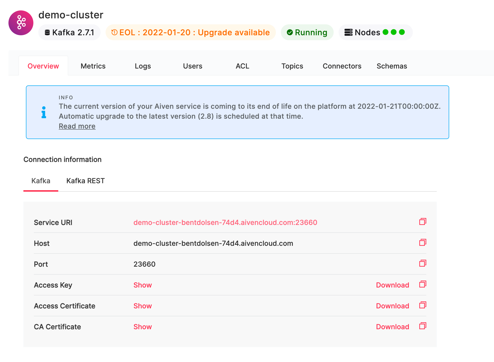
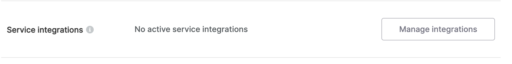
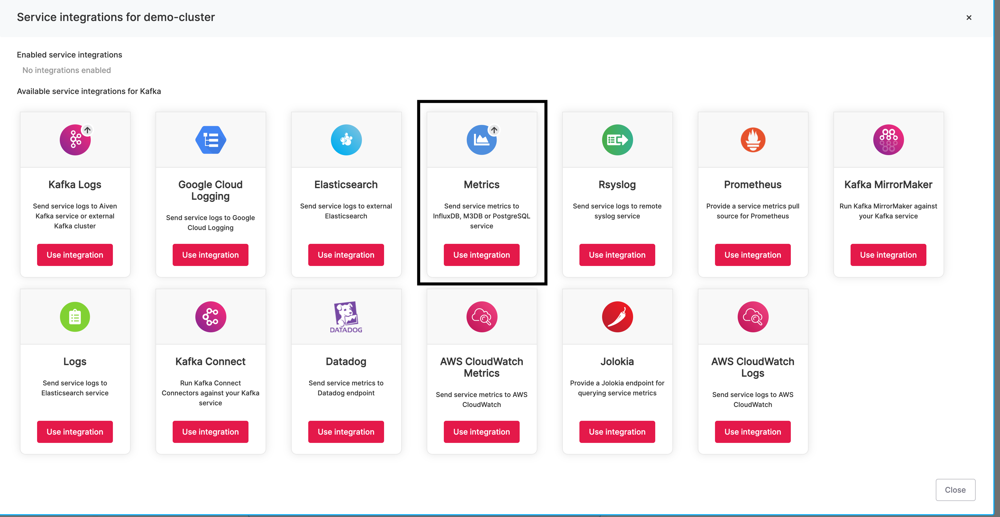
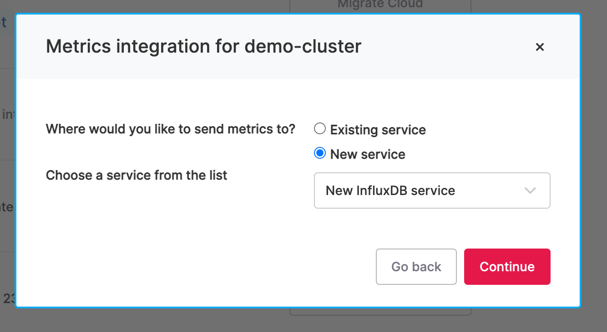
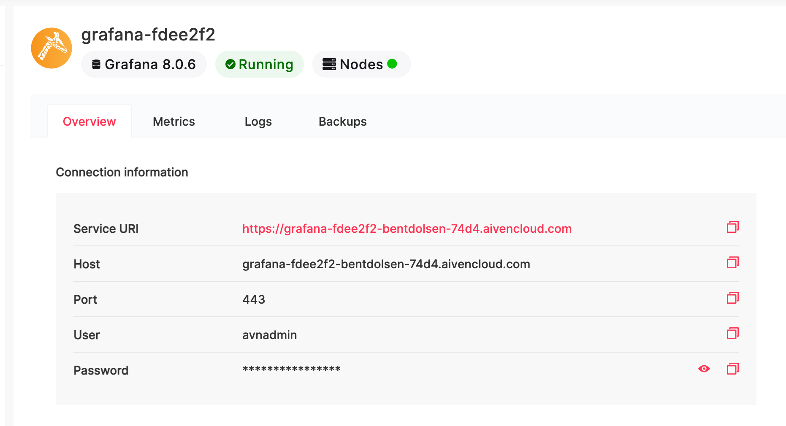
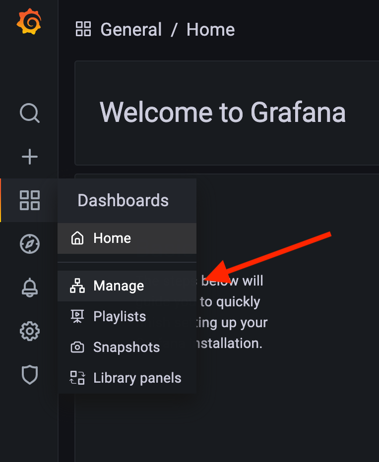

## Getting Started with Aiven and Kafka with Java and Micronaut

### Why Kafka + Aiven

Kafka is a popular technology used for building data streaming applications and is often used in reactive architectures.
Kafka is used by some of the largest companies in the world to handle billions of transactions and peta bytes of data on a daily basis.
While the benefits of building applications on top of Kafka are many it is rather complex to operate a Kafka cluster yourself.
Fortunately Aiven provides a hosted Kafka solution that removes a lot of this burden from your team and let's you focus on
building your application.

The following describes how to get started with Kafka using Aiven.

### Micronaut bootstrap project

Kafka is supported in many languages and frameworks. For this particular example we will be using Java and Micronaut.io which is a microservices
framework.

You can manually set up your project but Micronaut provides a convenient command line tool that will get you started in no time.
To install the command line tools using Homebrew on mac run the following command:

```shell
brew install --cask micronaut-projects/tap/micronaut
```

For Homebrew alternatives see the [Micronaut documentation](https://micronaut-projects.github.io/micronaut-starter/latest/guide/#installation).

Once you have Micronaut CLI installed you can then create a Kafka Starter application like so:

```shell
mn create-messaging-app my-aiven-kafka-app --features kafka
```

Of course change the `my-aiven-kafka-app` piece to whatever you desire.

Running this command will set up a gradle project with the basic Micronaut and Kafka configuration that you need to build
messaging applications. The project currently just has an Application.java class which is what starts the Micronaut application.

We can also use the Micronaut CLI to add a basic Kafka producer like so:

```shell
mn create-kafka-producer PageViewProducer
```

which will create a producer file called PageViewProducer.java that looks like this:

```java
package my.aiven.kafka.app;
import io.micronaut.configuration.kafka.annotation.KafkaClient;

@KafkaClient
public interface PageViewProducer {

}
```

The key things to note here is:
* the @KafkaClient annotation - this tells Micronaut that this is a Kafka Producer
* this is an interface, behind the scenes Micronaut will create an actual implementation of the producer

The producer is not capable of anything just yet, but we can change that by adding method declarations. Let's say we want
to write out a PageView class with a key of type PageViewKey then we could do that like so:

```java
@Topic("pageviews")
void sendPageView(@KafkaKey PageViewKey key, PageView pageView);
```

We now have a fully functioning producer that we can inject into other beans. E.g. to send a page view to the pageviews topic
using this producer we can do the following:

```java
@Singleton
public class PageViewGenerator {
    protected final PageViewProducer producer;

    public PageViewGenerator(PageViewProducer producer) {
        this.producer = producer;
    }

    public void generatePageView() {
        PageViewKey pageViewKey = new PageViewKey();
        // populate page view key
        PageView pageView = new PageView();
        // populate page view
        producer.sendPageView(pageViewKey, pageView);
    }
}
```

### Creating the Aiven Kafka Cluster

First signup for an account at Aiven, then in the services view click on _+Create New Service_. Once you selected Kafka
you have a few choices to make such as which cloud provider to use and what size cluster you want. Appropriate sizing a cluster
is not an easy task but Aiven allows you to upgrade your cluster after initially creating it so that it can continue to meet your needs.
If you are just playing around the startup option should be sufficient.

Now that the cluster has been created we can connect it to our application, but before we do that we need to create
the topic that the application uses. To do this, navigate to your Kafka cluster in the Aiven console and select the topics
tab as shown below:


Type in the name of the topic, for this sample application we used pageviews. For the sample application we can use the
default settings but generally you want to think carefully about how you want to configure your topics as it varies
significantly depending on your application needs.

### Connecting Aiven Kafka to our Micronaut application

We first need to get the configuration details from Aiven. To do this navigate to the Kafka cluster you just created and go to the
overview tab. The first section on the page contains the connection parameters and will look something like this:



All communication with the Aiven cluster is encrypted over an SSL connection. To set this up we
first need to download the Access Key, Access Certificate and CA Certificate. In the folder where you downloaded
the file use openssl to generate the key store:

```shell
openssl pkcs12 -export -inkey service.key -in service.cert -out client.keystore.p12 -name service_key
```

Then use the keytool to generate the trust store:
```shell
keytool -import -file ca.pem -alias CA -keystore client.truststore.jks
```

Now that we have those files generated we need to configure Micronaut and Kafka to use them. We do this
through the src/main/resources/application.yml file in your Micronaut project. Add the following configuration
for Kafka SSL:

```yaml
kafka:
  bootstrap:
    servers: <SERVICE URI>
  ssl:
    keystore:
      location: client.keystore.p12
      password: <INSERT YOUR KEYSTORE PASSWORD HERE>
    truststore:
      location: client.truststore.jks
      password: <INSERT YOUR TRUSTSTORE PASSWORD HERE>
      type: PKCS12
  security:
    protocol: ssl
```

And finally we need to configure the bootstrap server URL. In the same file insert your service URI to the 
kafka.bootstrap.servers property like so:

```yaml
kafka:
  bootstrap:
    servers: <SERVICE URI>
```

You should now be able to run your application and produce messages to the Aiven Kafka cluster.

### Serialization and Deserialization

When writing data to and consuming data from Kafka it's important that the data is formatted properly.
You can write anything to your messages as they are just binary data, but there are 3 standard formats that
people use with Kafka: avro, json and protobuf. You will notice that in our producer above we did not tell
Micronaut how to serialize the data we write to Kafka, but it still worked. This is because Micronaut by
default comes configured with JSON as the default (de)-serializers so when we wrote our POJO Micronaut used
Jackson behind the scenes to convert the POJO to JSON.

By default Jackson writes dates as timestamps which means they are just numbers. This isn't the greatest format
for interoperability and it's better to use the ISO8601 format. To make Micronaut and Jackson do that we can
add the following to our application.yml file:

```yaml
jackson:
  serialization:
    writeDatesAsTimestamps: false
```

### Aiven Observability

The Aiven dashboard for the different services offered features a built-in metrics view for the instances
making up the service. These are certainly important but when monitoring a Kafka cluster there are a
number of additional critical metrics you need to be able to monitor and alert on. Fortunately Aiven
makes it easy to get these additional metrics by following these steps:

#### Send Kafka metrics to Influx DB

To send Kafka metrics to Influx DB go to the Kafka service overview page and scroll down until you see
Service Integrations:



Then click on Manage Integrations and select the Metrics option as highlighted below:



In the dialog that comes up select New Service and select New InfluxDB service as shown below:



This will create a new InfluxDB instance in your Aiven account and will automatically start sending metrics
from your Kafka cluster to it.

#### Visualizing metrics with Grafana

Aiven also has built-in visualization options for the data in InfluxDB through a Grafana integration.
To enable this integration navigate to the InfluxDB service that was created and scroll down to the
Service Integrations section and click on Manage Integrations. In the dialog that appears select the
Dashboard option as shown below:


In the resulting dialog select to create a New Service and select New Grafana Service:


Once the Grafana service has been fully created you can now view the detailed Kafka metrics in the
built-in Kafka dashboard. To see this dashboard you need to use the Grafana web application directly.
To get the url for this navigate to the Grafana service that was created and you should see the following
information:



Open the Service URI in a new tab and use the User and Password from the connection info screen as the
credentials to log in to Grafana.

Once in Grafana you need to find the Kafka dashboard that has already been set up. You can find it under
Dashboards -> Manage as shown below:



